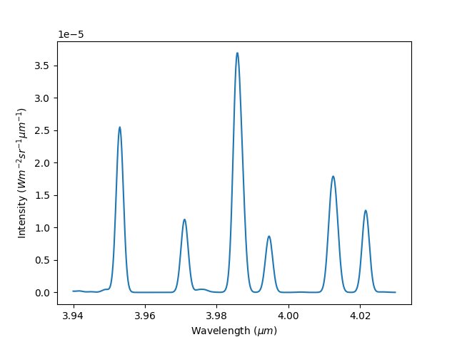
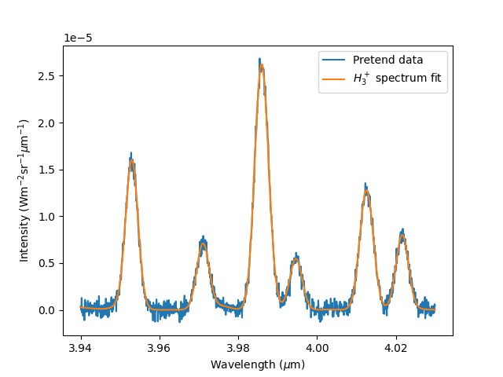
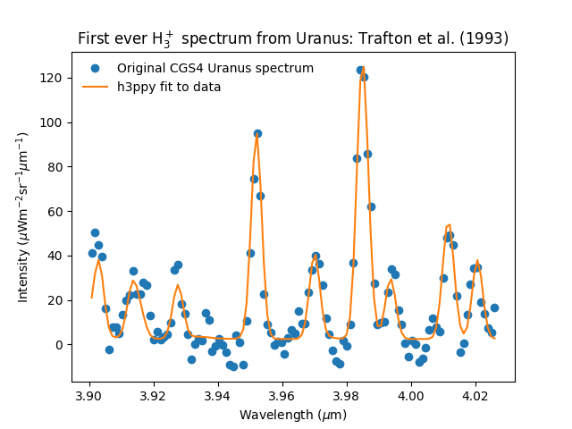
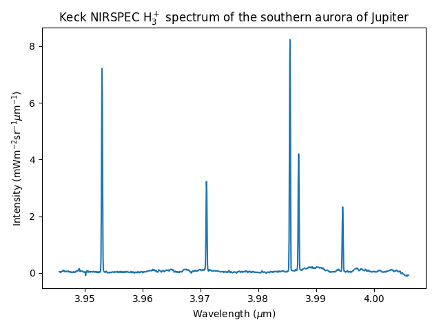
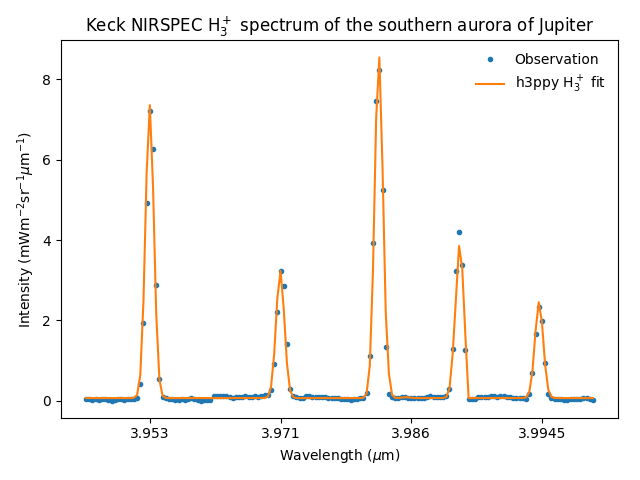
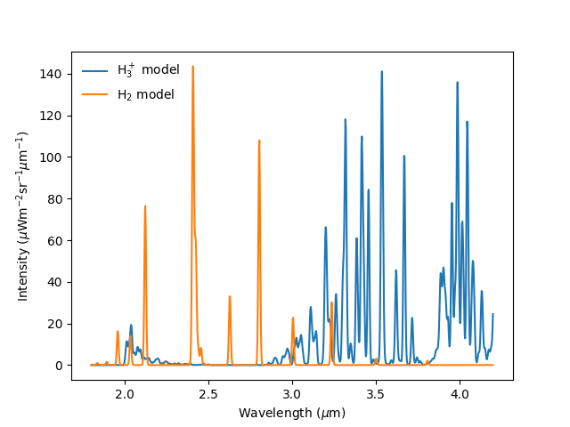
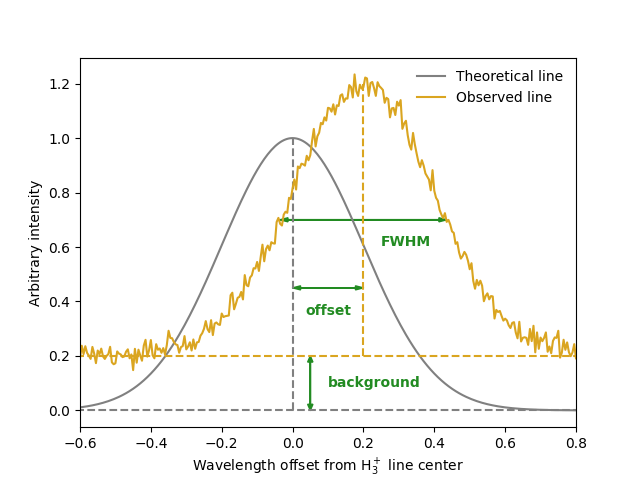

# h3ppy 😁

A python package for modelling and fitting H<sub>3</sub><sup>+</sup> and H<sub>2</sub> spectra, pronounced "happy". Great! 

## Install via pip
```
pip3 install h3ppy
```
Or to upgrade to the latest greatest version: 
```
pip3 install h3ppy --upgrade
```

## Table of content

  * [Generate a model H<sub>3</sub><sup>+</sup> spectrum](#generate-a-model-h-sub-3--sub--sup----sup--spectrum)
  * [Fitting observed spectra](#fitting-observed-spectra)
- [Real world (universe) examples](#real-world--universe--examples)
  * [Example 1: UKIRT CGS4 Uranus spectrum](#example-1--ukirt-cgs4-uranus-spectrum)
  * [Example 2: Keck II NIRSPEC spectrum of Jupiter's aurora](#example-2--keck-ii-nirspec-spectrum-of-jupiter-s-aurora)
  * [Example 3: Modelling the H<sub>2</sub> spectrum](#example-3--modelling-the-h-sub-2--sub--spectrum)
- [Input parameters](#input-parameters)
    + [The line width](#the-line-width)
    + [The parameters of a spectrum](#the-parameters-of-a-spectrum)
    + [Using different H<sub>3</sub><sup>+</sup> line data](#using-different-h-sub-3--sub--sup----sup--line-data)
- [Data resources](#data-resources)


## Generate a model H<sub>3</sub><sup>+</sup> spectrum 


The code below generate an example spectrum: 

```python
import h3ppy
import matplotlib.pyplot as plt
import numpy as np

# Create the H3+ object
h3p = h3ppy.h3p()

# Define a wavelength range, e.g. typical of an observation of the H3+ Q branch
# Specify the start and end wavelengths, and the number of wavelength elements
wave = h3p.wavegen(3.94, 4.03, 1024)

# Create a H3+ model spectrum for a set of physical parameters 
# Spectral resolution R = 1200, T = 1000, N = 1e14
# This is the minimum set of parameters required for generating a model
model = h3p.model(density = 1e14, temperature = 1000, R = 1000, wavelength = wave)

# Plot the model
fig, ax = plt.subplots()
ax.plot(wave, model)
# Automagically set the labels 
ax.set_xlabel(h3p.xlabel())
ax.set_ylabel(h3p.ylabel())
plt.savefig('example_model.png')
plt.close() 
```
This creates the following H<sub>3</sub><sup>+</sup> spectrum: 

<p align="center"> 

</p>

Neat, right?! We can now generate the spectrum for any temperature and density combination, with different wavelength coverage and at different spectral resolutions. 


## Fitting observed spectra

Here we'll simulate a pretend H<sub>3</sub><sup>+</sup> observation by adding some noise to the model spectrum above, and the we'll use `h3ppy` to fit physical parameters to it. 

```python
# Generate some noise to add to the model  
noise = np.random.normal(size = model.size) * np.max(model) / 50
pretend_data = model + noise

# Set the initial guess for the data. I'm making it different from the model input
# to show that the fit actually can converge on 'real' values
h3p.set(density = 1e13, temperature = 1300, data = pretend_data)

# Let h3ppy make an initial guess at the density
h3p.guess_density()

# Fit temperature and density to the pretend data
fit = h3p.fit()

# Get the fit variables and associated errors
vars, errs = h3p.get_results()

# Plot the model
fig, ax = plt.subplots()
ax.plot(wave, pretend_data, label='Pretend data')
ax.plot(wave, fit, label = '$H_3^+$ spectrum fit')
ax.legend()
# Automagically set the labels 
ax.set_xlabel(h3p.xlabel())
ax.set_ylabel(h3p.ylabel())
plt.savefig('../img/example_fit.png')
plt.close() 
```
Which produces an output in the console like:

```
[h3ppy]  Spectrum parameters:
         Temperature    = 1007.2 ± 8.3 [K]
         Column density = 9.81E+13 ± 1.97E+12 [m-2]
         ------------------------------
         sigma-0 = 1.59E-03 ± 6.92E-06
         offset-0 = -4.69E-07 ± 5.93E-06
         background-0 = 1.62E-08 ± 2.14E-08
```
Which is the same temperature and density as what we produced the model with, within the error bars of the fit. The fit to the simulated H<sub>3</sub><sup>+</sup> data looks like this:

<p align="center"> 

</p>

# Real world (universe) examples 

Below are a number of examples of how `h3ppy` can be applied to actual observations. The python code and the observations are contained in the `examples/` folder. 

## Example 1: UKIRT CGS4 Uranus spectrum

In my opinion, there are few spectra that are as historic as this one. It's the first spectrum of H<sub>3</sub><sup>+</sup> emission from Uranus and it was taken by Larry Trafton with the United Kingdom Infrared Telescope (UKIRT, now sadly defunct) in Hawai'i in 1992, and was published by [Trafton et al. (1993, Astronomical Journal, 405, 761-766)](https://ui.adsabs.harvard.edu/abs/1993ApJ...405..761T/abstract). The full code for this example is contained in [`examples/cgs4_uranus.py`](examples/cgs4_uranus.py)

```python
import matplotlib.pyplot as plt
import numpy as np
import h3ppy

# Read the UKIRT CGS4 data from Trafton et al., (1993)
data_file = 'cgs4_uranus_u01apr92.txt'
types = {'names' : ( 'w', 'i' ), 'formats' : ('f', 'f') }
dat = np.loadtxt(data_file, skiprows=4, dtype = types)

# Need to convert the instrument FOV to units of sterradian
# The pixel width is 3.1 arcsec with a slit widht of 3.1 arcsec
# Note - there are 4.2545e10 arceconds in a sterradian
spectrum = dat['i'] * 4.2545e10 / (3.1 * 3.1)
wave = dat['w']

# Make our h3ppy object :-) 
h3p = h3ppy.h3p()

# Set the wavelength and data, and use the spectral resulution to input the 
# expected line width
h3p.set(wavelength = wave, data = spectrum, R = 1300)

# We need to guess a temperature
h3p.set(temperature = 1000)

# Let h3ppy try and guess a wavelength offset
guess = h3p.guess_offset()

# Guess the density - this'll effectively scale the spectrum to the observed spectrum
# It really is not a measure of the actual density!  
guess = h3p.guess_density()

# Let h3ppy do the fitting - this will do a full five parameter fit
fit = h3p.fit(verbose = False)    

# Get the results
vars, errs = h3p.get_results()

# Plot the results! 
fig, ax = plt.subplots()
ax.set_title('First ever H$_3^+$ spectrum from Uranus: Trafton et al. (1993)')
ax.plot(wave, spectrum * 1e6, 'o', label = 'Original CGS4 Uranus spectrum')
ax.plot(wave, fit * 1e6, label = 'h3ppy fit to data')
ax.legend(frameon = False)

# Use the h3ppy helper functions for the labels
ax.set_xlabel(h3p.xlabel())
ax.set_ylabel(h3p.ylabel(prefix = '$\mu$'))
plt.savefig('../img/cgs4_uranus_fit.png')
plt.close()

```
Which produces this fit: 

<p align="center"> 

</p>

and an output in the console of:

```
[h3ppy]  Spectrum parameters:
         Temperature    = 751.5 ± 42.7 [K]
         Column density = 1.23E+15 ± 2.73E+14 [m-2]
         ------------------------------
         sigma-0 = 1.63E-03 ± 6.49E-05
         offset-0 = -9.91E-04 ± 5.64E-05
         background-0 = 2.40E-06 ± 8.77E-07
```
which is very close to the published result, T = 740 K, that Trafton et al. (1992) got - yas! Also, note that `h3ppy` is using H<sub>3</sub><sup>+</sup> line lists and partition functions that weren't available in 1992! This shows that `h3ppy` can reproduce past results, which is reassuring! 


## Example 2: Keck II NIRSPEC spectrum of Jupiter's aurora 

The twin Keck telescopes on Mauna Kea in Hawai'i are the largest optical telescopes in the world, and they have been used to observe H<sub>3</sub><sup>+</sup> from the giant planets. Here, we will examine a spectrum of Jupiter's southern aurora obtained with the [NIRSPEC instrument](https://www2.keck.hawaii.edu/inst/nirspec/). The full code for this example is contained in [`examples/nirspec_jupiter.py`](examples/nirspec_jupiter.py)

NIRSPEC has a spectral resolution of `R = λ/Δλ ~ 20000`, which is sufficient to separate the H<sub>3</sub><sup>+</sup> transition lines from each other. First we plot the data. 

```python
import matplotlib.pyplot as plt
import numpy as np
import h3ppy

# Read the NASA IRTF CGS4 data from Trafton et al., (1993)
data_file = 'nirspec_jupiter.txt'
types = {'names' : ( 'w', 'i' ), 'formats' : ('f', 'f') }
dat = np.loadtxt(data_file, skiprows=4, dtype = types)
wave = dat['w']
spec = dat['i']

# Create the h3ppy object feed data into it
# The spectral resolution of NIRSPEC is ~20k
h3p = h3ppy.h3p()

# Plot the observation
title = 'Keck NIRSPEC H$_3^+$ spectrum of the southern aurora of Jupiter'
fig, ax = plt.subplots()
ax.plot(wave, spec * 1e3)
ax.set(xlabel = h3p.xlabel(), ylabel = h3p.ylabel(prefix = 'm'), title = title)
plt.tight_layout()
plt.savefig('../img/nirspec_jupiter_data.png')
# plt.show()
plt.close()

```
Which produces this spectrum:

<p align="center"> 

</p>

Since we are operating at a moderately high spectral resolution, I'm going to sub-divide the data, focusing on the individual spectral lines. This will not adversely affect the fit, since it is the relative intesity of the H<sub>3</sub><sup>+</sup> spectral lines that determine the temperature and the density. By zooming into the plot above, I determine the approximate wavelength of the group of lines.  The code below will reduce the wavelength range to focus only on the relevant H<sub>3</sub><sup>+</sup> line regions, and then fit the resulting spectrum. 

```python
# This function sub-divides data centered on a list of wavelengths
def subdivide(wave, spec, middles, width = 20) : 
    ret = []
    for m in middles : 
        centre = np.abs(wave - m).argmin()
        for i in range(centre - width, centre + width) : 
            ret.append(spec[i])
    return np.array(ret)
    
# The H3+ line centeres contained withing this spectral band
centers = [3.953, 3.971, 3.986, 3.9945]
cpos = np.arange(4) * 41 + 20

# Create sub-arrays, focusing on where the H3+ lines are
subspec = subdivide(wave, spec, centers)
subwave = subdivide(wave, wave, centers)

# Set the wavelength and the data
h3p.set(wavelength = subwave, data = subspec, R = 20000)

# Create a x scale for plotting 
xx      = range(len(subspec))

# Guess the density and proceed with a five parameter fit
h3p.guess_density()
fit = h3p.fit()
vars, errs = h3p.get_results()

# Plot the fit
fig, ax = plt.subplots()
ax.plot(xx, subspec * 1e3, '.', label = 'Observation')
ax.plot(xx, fit * 1e3, label = 'h3ppy H$_3^+$ fit')
ax.set(xlabel = h3p.xlabel(), ylabel = h3p.ylabel(prefix = 'm'), xticks = cpos, title=title)
ax.set_xticklabels(centers)
ax.legend(frameon = False)
plt.tight_layout()
plt.savefig('../img/nirspec_jupiter_fit.png')
plt.close()

```

which produces a console output of 

```
[h3ppy] Estimated density = 2.09E+15 m-2
[h3ppy]  Spectrum parameters:
         Temperature    = 923.6 ± 31.9 [K]
         Column density = 2.64E+15 ± 2.46E+14 [m-2]
         ------------------------------
         background-0 = 6.77E-05 ± 1.69E-05
         offset-0 = -1.46E-05 ± 1.13E-06
         sigma-0 = 7.82E-05 ± 1.17E-06
```
And looks like: 
<p align="center"> 

</p>

<!-- 
### Fitting more advanced polynomial expressions
So we have a decent fit to the NIRSPEC data above. However, `h3ppy` is capable of fitting polynomial expressions to the sigma (line-width), wavelength offset, and background. In the example below, we will re-fit the Keck data using more complex expressions for these parameters to see if we can improve the fit by increasing the complexity of the spectral fit. 
-->


<!-- ## Example 3: James Webb Space Telescope - NIRSpec proposals -->

<!-- The James Webb Space Telescope (JWST) is the most powerful and expensive telescope ever contorted. Once launched and in orbit it will be an amazing tool with which to observe H<sub>3</sub><sup>+</sup> through the solar system and beyond. The (NIRSPEC)[https://www.jwst.nasa.gov/content/observatory/instruments/nirspec.html] instruments provides spectra capabilities in the 1 to 5 μm range, which overlaps nicely with the brightest H<sub>3</sub><sup>+</sup> emission lines. The (JWST Exposure Time Calculator)[https://jwst.etc.stsci.edu/] is a tool used for generating signal-to-noise predictions for a given set of -->

## Example 3: Modelling the H<sub>2</sub> spectrum

As of `h3ppy` version 0.3.0, there's the functionality to model the quadropole H<sub>2</sub> spectrum. The `h2` class is functionally identical to the `h3p` class (it's inherited from it), so works in the same way.

```python
import h3ppy
import matplotlib.pyplot as plt
import numpy as np

# Instrument resolution
R = 300

# Temperature of the thermosphere
T = 900

# Set up the H3+ model
h3p = h3ppy.h3p()
h3p.set(temperature = T, density = 2e15, R = R)
wave = h3p.wavegen(1.8, 4.2, 1000)

# Set up the H2 model
amagat = 2.76e25
h2 = h3ppy.h2()
h2.set(temperature = T, density = amagat, R = R, wavelength = wave)

# Generate models
model_h3p = h3p.model()
model_h2  = h2.model()

# Plot the result
fig, ax = plt.subplots()
ax.plot(wave, model_h3p * 1e6, label = 'H$_3^+$ model')
ax.plot(wave, model_h2 * 1e6, label = 'H$_2$ model')
ax.set(ylabel = h3p.ylabel(prefix = '$\mu$'), xlabel = h3p.xlabel())
ax.legend(frameon = False)
plt.save('img/h2_h3p_spectrum.png')

```
Which looks like: 
<p align="center"> 

</p>


# Input parameters

The `set()`, `model()`, and `fit()` methods accepts the following inputs:


* `wavelength`, `wave`, `w` - the wavelength scale on which to produce the model.  
* `data` - the observed H<sub>3</sub><sup>+</sup> spectrum
* `temperature`, `T` - the intensity of the H<sub>3</sub><sup>+</sup> spectral lines are an exponential function of the temperature. Typical ranges for the ionosphere's of the giant planets are 400 (Saturn) to 1500 K (Jupiter). 
* `density`, `N` - the column integrated H<sub>3</sub><sup>+</sup> density, this is the number of ions along the line of sight vector.
* `sigma_n` - the _n_th polynomial constant of the spectral line width (sigma)
* `offset_n` - the _n_th polynomial constant of the wavelength offset from the rest wavelength. Doppler shift and wavelength calibration errors can offset the wavelength scale. 
* `background_n` - he _n_th polynomial constant of the displacement from the zero intensity level of the spectrum
* `nsigma` - the number of polynomial constant used for the sigma.
* `noffset` - the number of polynomial constant used for the offset.
* `nbackground` - the number of polynomial constant used for the background.


The parameters with `_n` suffix indicates that they are the nth polynomial constant. For example, if we want use the following function to describe the sigma:
```
sigma = sigma_0 + sigma_1 * wavelength + sigma_2 * wavelength^2
```
then we need to specify the following: 
```python
h3p.set(nsigma = 3, sigma_0 = 0.1, sigma_1 = 0.01, sigma_2 = 0.001) 
```

### The line width
Here we parameterise the width of the H<sub>3</sub><sup>+</sup> lines with the `sigma-n` parameter. It is related to the full width of a line profile at half maximum (FWHM) by this expression: 
```python
FWHM = 2 * np.sqrt(2 * np.log(2)) * sigma = 2.35482 * sigma
```

### The parameters of a spectrum
The figure below illustrates how the evaluated polynomials for the offset, sigma (via the FWHM), and background at a particular wavelength determines the way that the line-intensities are distributed over across wavelength space.   

<p align="center"> 

</p>


### Using different H<sub>3</sub><sup>+</sup> line data

If you want to use a different set of line-data you can specify a different file when you create the `h3ppy.h3p()` object. For example: 

```
h3p = h3ppy.h3p(line_list_file = '/path/to/h3p_line_list_neale_1996_detailed.txt')
```
where the `h3p_line_list_neale_1996_detailed.txt` file is available on this GitHub directory, containing a greater number of transition lines. There is also `h3p_line_list_neale_1996_very_detailed.txt` (unzip before use). Obviously using a larger line-list will slow down all aspects of `h3ppy` (sad). 

You can also concoct your own line list. The reader expects five columns in this order 

1. Angular momentum quantum number of upper level (J<sub>upper</sub>)
2. Wavenumber of the upper level (ω<sub>upper</sub> in cm<sup>-1</sup>)
3. Wavenumber of the transition (ω in cm<sup>-1</sup>)
4. Einstein A coefficient (A)
5. Spin weighting (g<sub>ns</sub>)

Note that the reader will skip the first line of the line list file. 


# Data resources 
`h3ppy` uses H<sub>3</sub><sup>+</sup> data to produce models and fits from the following resources:

* The H<sub>3</sub><sup>+</sup> line list from [Neale et al. (1996)](https://ui.adsabs.harvard.edu/abs/1996ApJ...464..516N/abstract) - this data is available for download on the [Exo Mol website](http://www.exomol.com/data/molecules/H3_p/1H3_p/NMT/).
* The H<sub>3</sub><sup>+</sup> partition function (Q) and total emission (E) from [Miller et al. (2013)](https://ui.adsabs.harvard.edu/abs/2013JPCA..117.9770M/abstract).
* The H<sub>2</sub> line list and partition functioin from [Roueff et al. (2019)](https://ui.adsabs.harvard.edu/abs/2019A%26A...630A..58R/abstract).

