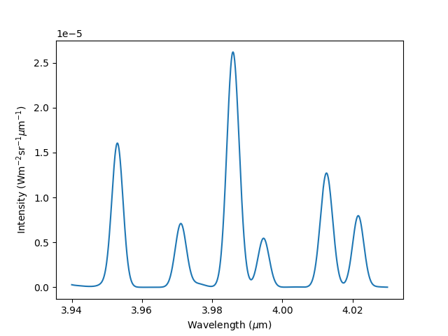

# h3ppy 😁

A python package for modelling and fitting H<sub>3</sub><sup>+</sup> spectra. Great! 

## Install via pip
```
pip3 install h3ppy
```
## Generate a model H<sub>3</sub><sup>+</sup> spectrum 

The shape of a H<sub>3</sub><sup>+</sup> spectrum is determined by a number of parameters 

* `Temperature` - the intensity of the H<sub>3</sub><sup>+</sup> spectral lines are an exponential function of the temperature. Typical ranges for the ionosphere's of the giant planets are 400 (Saturn) to 1500 K (Jupiter).
* `density` - the column integrated H<sub>3</sub><sup>+</sup> density, this is the number of ions along the line of sight vector.
* `sigma-0` - spectral line width (sigma)
* `offset-0` - wavelength offset from the rest wavelength. Doppler shift and wavelength calibration errors can offset the wavelength scale. 
* `background-0` - A polynomial offset from the zero intensity level of the spectrum

The code below generate an example spectrum: 

```python
import h3ppy
import matplotlib.pyplot as plt
import numpy as np

# Create the H3+ object
h3p = h3ppy.h3p()

# Define an wavelength range, typical of an observation of the Q branch
wave = h3p.wavegen(3.94, 4.03, 512)

# Create a model for a set of physical parameters 
model = h3p.model(density = 1e14, temperature = 1000, sigma = 0.001, wavelength = wave)

plt.plot(wave, model, color='red')
plt.xlabel('Wavelength (${\mu}m$)')
plt.ylabel('Intensity ($Wm^{-2}sr^{-1}{\mu}m^{-1}$)')
plt.savefig('example_model.png')
```
This creates the following spectra: 



## Fitting observed spectra

Here we'll simulate a pretend H<sub>3</sub><sup>+</sup> observations by adding some noise to the spectrum above, and the we'll use h3ppy to fit physical parameters to it. 

```python
# Generate some noise to add to the model  
noise = np.random.normal(size = model.size) * np.max(model) / 100
pretend_data = model + noise

# Set the initial guess for the data. I'm making it different from the model input
# to show that the fit actually can converge on 'real' values
h3p.set(density = 5e13, temperature = 1300)

# Fit the spectrum
fit = h3p.fit(data = pretend_data)

# Get the fit variables and associated errors
vars, errs = h3p.get_results()

plt.plot(wave, pretend_data, label='Pretend data')
plt.plot(wave, fit, label = '$H_3^+$ spectrum fit')
plt.legend
plt.savefig('example_fit.png')
```
Which produces an output in the console like:

```
[h3ppy]  Spectrum parameters:
         Temperature    = 1006.6 ± 13.0 [K]
         Column density = 9.84E+13 ± 3.05E+12 [m-2]
         ------------------------------
         sigma-0 = 1.00E-03 ± 0.00E+00
         offset-0 = 0.00E+00 ± 0.00E+00
         background-0 = 0.00E+00 ± 0.00E+00
```
Which is entirely sensible and looks like:


