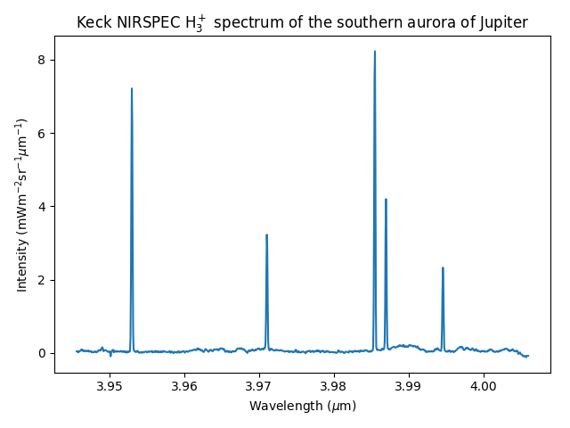
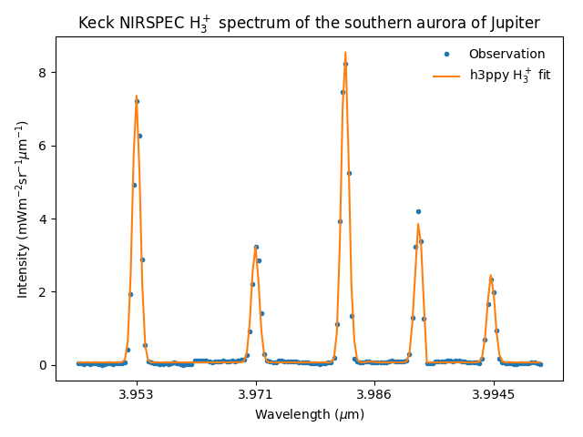

.. _Examples:

Examples
========


Plotting a basic :math:`\text{H}_3^+` model
*******************************************

.. code-block:: python

    import h3ppy
    import matplotlib.pyplot as plt
    import numpy as np

    # Create the H3+ object
    h3p = h3ppy.h3p()

    # Define a wavelength range, e.g. typical of an observation of the H3+ Q branch
    # Specify the start and end wavelengths, and the number of wavelength elements
    wave = h3p.wavegen(3.94, 4.03, 1024)

    # Create a H3+ model spectrum for a set of physical parameters 
    # Spectral resolution R = 1200, T = 1000, N = 1e14
    # This is the minimum set of parameters required for generating a model
    model = h3p.model(density = 1e14, temperature = 1000, R = 1000, wavelength = wave)

    # Plot the model
    fig, ax = plt.subplots()
    ax.plot(wave, model)
    # Automagically set the labels 
    ax.set(xlabel = h3p.xlabel(), ylabel = h3p.ylabel())

This creates the following :math:`\text{H}_3^+` spectrum: 

.. figure:: ../img/example_model.png

Neat, right?! We can now generate the spectrum for any temperature and density combination, with different wavelength coverage and at different spectral resolutions. 

Real world (universe) examples 
******************************

Below are a number of examples of how `h3ppy` can be applied to actual observations. The python code and the data are contained in the `examples/` folder on the `GitHub site <https://github.com/henrikmelin/h3ppy>`_. 

Example 1: UKIRT CGS4 Uranus spectrum
-------------------------------------

In our opinion, there are few spectra that are as historic as this one. It's the first spectrum of :math:`\text{H}_3^+` emission from Uranus and it was taken by Larry Trafton with the United Kingdom Infrared Telescope (UKIRT, now sadly defunct) in Hawai'i in 1992, and was published by `Trafton et al. (1993, Astronomical Journal, 405, 761-766) <https://ui.adsabs.harvard.edu/abs/1993ApJ...405..761T/abstract>`_. The code and data for this example can be found `here <https://github.com/henrikmelin/h3ppy/blob/master/examples/>`_.

.. code-block:: python

    import matplotlib.pyplot as plt
    import numpy as np
    import h3ppy

    # Read the UKIRT CGS4 data from Trafton et al., (1993)
    data_file = 'cgs4_uranus_u01apr92.txt'
    types = {'names' : ( 'w', 'i' ), 'formats' : ('f', 'f') }
    dat = np.loadtxt(data_file, skiprows=4, dtype = types)

    # Need to convert the instrument FOV to units of sterradian
    # The pixel width is 3.1 arcsec with a slit widht of 3.1 arcsec
    # Note - there are 4.2545e10 arceconds in a sterradian
    spectrum = dat['i'] * 4.2545e10 / (3.1 * 3.1)
    wave = dat['w']

    # Make our h3ppy object :-) 
    h3p = h3ppy.h3p()

    # Set the wavelength and data, and use the spectral resulution to input the 
    # expected line width
    h3p.set(wavelength = wave, data = spectrum, R = 1300)

    # We need to guess a temperature
    h3p.set(temperature = 1000)

    # Let h3ppy try and guess a wavelength offset
    guess = h3p.guess_offset()

    # Guess the density - this'll effectively scale the spectrum to the observed spectrum
    # It really is not a measure of the actual density!  
    guess = h3p.guess_density()

    # Let h3ppy do the fitting - this will do a full five parameter fit
    fit = h3p.fit(verbose = False)    

    # Get the results
    vars, errs = h3p.get_results()

    # Plot the results! 
    fig, ax = plt.subplots()
    ax.set_title('First ever H$_3^+$ spectrum from Uranus: Trafton et al. (1993)')
    ax.plot(wave, spectrum * 1e6, 'o', label = 'Original CGS4 Uranus spectrum')
    ax.plot(wave, fit * 1e6, label = 'h3ppy fit to data')
    ax.legend(frameon = False)

    # Use the h3ppy helper functions for the labels
    ax.set_xlabel(h3p.xlabel())
    ax.set_ylabel(h3p.ylabel(prefix = '$\mu$'))
    plt.savefig('../img/cgs4_uranus_fit.png')
    plt.close()

Which produces this fit: 

.. figure:: ../img/cgs4_uranus_fit.png

and an output in the console of:

.. code-block:: console

    [h3ppy]  Spectrum parameters:
            Temperature    = 751.5 ± 42.7 [K]
            Column density = 1.23E+15 ± 2.73E+14 [m-2]
            ------------------------------
            sigma-0 = 1.63E-03 ± 6.49E-05
            offset-0 = -9.91E-04 ± 5.64E-05
            background-0 = 2.40E-06 ± 8.77E-07

which is very close to the published result, T = 740 K, that Trafton et al. (1992) got - yas! Also, note that `h3ppy` is using a :math:`\text{H}_3^+` line list and partition function that weren't available in 1992. This shows that `h3ppy` can reproduce past results, which is reassuring! 

Example 2: Keck II NIRSPEC spectrum of Jupiter's aurora
-------------------------------------------------------

The twin Keck telescopes on Mauna Kea in Hawai'i are the largest optical telescopes in the world, and they have been used to observe :math:`\text{H}_3^+` from the giant planets. Here, we will examine a spectrum of Jupiter's southern aurora obtained with the `NIRSPEC instrument <https://www2.keck.hawaii.edu/inst/nirspec/>`_. The code and data for this example can be found `here <https://github.com/henrikmelin/h3ppy/blob/master/examples/>`_.

NIRSPEC has a spectral resolution of :math:`R = \frac{\lambda}{\Delta \lambda} \sim 20,000`, which is sufficient to separate the :math:`\text{H}_3^+` transition lines from each other. First we plot the data. 

.. code-block:: python

    import matplotlib.pyplot as plt
    import numpy as np
    import h3ppy

    # Read the Keck Jupiter data
    data_file = 'nirspec_jupiter.txt'
    types = {'names' : ( 'w', 'i' ), 'formats' : ('f', 'f') }
    dat = np.loadtxt(data_file, skiprows=4, dtype = types)
    wave = dat['w']
    spec = dat['i']

    # Create the h3ppy object feed data into it
    h3p = h3ppy.h3p()

    # Plot the observation
    title = 'Keck NIRSPEC H$_3^+$ spectrum of the southern aurora of Jupiter'
    fig, ax = plt.subplots()
    ax.plot(wave, spec * 1e3)
    ax.set(xlabel = h3p.xlabel(), ylabel = h3p.ylabel(prefix = 'm'), title = title)
    plt.tight_layout()
    plt.savefig('../img/nirspec_jupiter_data.png')
    # plt.show()
    plt.close()

Which produces this spectrum:



Since we are operating at a moderately high spectral resolution, I'm going to sub-divide the data, focusing on the individual spectral lines. This will not adversely affect the fit, since it is the relative intesity of the :math:`\text{H}_3^+` spectral lines that determine the temperature and the density. By zooming into the plot above, I determine the approximate wavelength of the group of lines.  The code below will reduce the wavelength range to focus only on the relevant :math:`\text{H}_3^+` line regions, and then fit the resulting spectrum. 

.. code-block:: python

    # This function sub-divides data centered on a list of wavelengths
    def subdivide(wave, spec, middles, width = 20) : 
        ret = []
        for m in middles : 
            centre = np.abs(wave - m).argmin()
            for i in range(centre - width, centre + width) : 
                ret.append(spec[i])
        return np.array(ret)
        
    # The H3+ line centeres contained withing this spectral band
    centers = [3.953, 3.971, 3.986, 3.9945]
    cpos = np.arange(4) * 41 + 20

    # Create sub-arrays, focusing on where the H3+ lines are
    subspec = subdivide(wave, spec, centers)
    subwave = subdivide(wave, wave, centers)

    # Set the wavelength and the data
    h3p.set(wavelength = subwave, data = subspec, R = 20000)

    # Create a x scale for plotting 
    xx      = range(len(subspec))

    # Guess the density and proceed with a five parameter fit
    h3p.guess_density()
    fit = h3p.fit()
    vars, errs = h3p.get_results()

    # Plot the fit
    fig, ax = plt.subplots()
    ax.plot(xx, subspec * 1e3, '.', label = 'Observation')
    ax.plot(xx, fit * 1e3, label = 'h3ppy H$_3^+$ fit')
    ax.set(xlabel = h3p.xlabel(), ylabel = h3p.ylabel(prefix = 'm'), xticks = cpos, title=title)
    ax.set_xticklabels(centers)
    ax.legend(frameon = False)
    plt.tight_layout()
    plt.savefig('../img/nirspec_jupiter_fit.png')
    plt.close()

which produces a console output of 

.. code-block:: console

    [h3ppy] Estimated density = 2.09E+15 m-2
    [h3ppy]  Spectrum parameters:
            Temperature    = 923.6 ± 31.9 [K]
            Column density = 2.64E+15 ± 2.46E+14 [m-2]
            ------------------------------
            background-0 = 6.77E-05 ± 1.69E-05
            offset-0 = -1.46E-05 ± 1.13E-06
            sigma-0 = 7.82E-05 ± 1.17E-06

And looks like: 



Example 3: Modelling the :math:`\text{H}_2` spectrum
-----------------------------------------------

As of `h3ppy` version 0.3.0, there's the functionality to model the quadropole :math:`\text{H}_2` spectrum. The `h2` class is functionally identical to the `h3p` class (it's inherited from it), so works in the same way.

.. code-block:: python

    import h3ppy
    import matplotlib.pyplot as plt
    import numpy as np

    # Instrument resolution
    R = 300

    # Temperature of the thermosphere
    T = 900

    # Set up the H3+ model
    h3p = h3ppy.h3p()
    h3p.set(temperature = T, density = 2e15, R = R)
    wave = h3p.wavegen(1.8, 4.2, 1000)

    # Set up the H2 model
    amagat = 2.76e25
    h2 = h3ppy.h2()
    h2.set(temperature = T, density = amagat, R = R, wavelength = wave)

    # Generate models
    model_h3p = h3p.model()
    model_h2  = h2.model()

    # Plot the result
    fig, ax = plt.subplots()
    ax.plot(wave, model_h3p * 1e6, label = 'H$_3^+$ model')
    ax.plot(wave, model_h2 * 1e6, label = 'H$_2$ model')
    ax.set(ylabel = h3p.ylabel(prefix = '$\mu$'), xlabel = h3p.xlabel())
    ax.legend(frameon = False)
    plt.save('img/h2_h3p_spectrum.png')

```
Which looks like: 

.. figure:: ../img/h2_h3p_spectrum.png