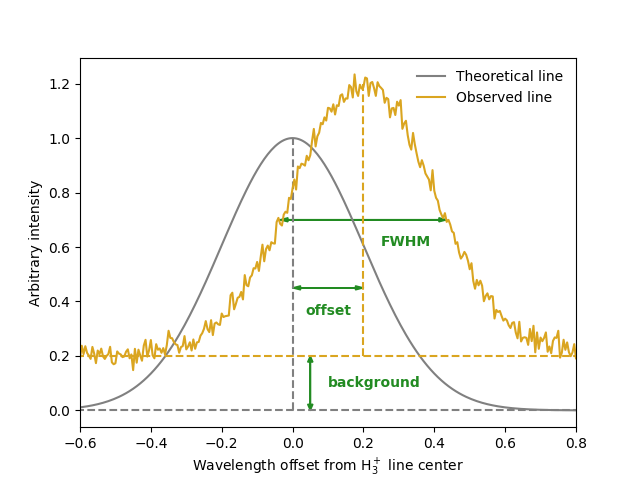

.. _Usage:

Basic Usage
===========

Creating your first :math:`\text{H}_3^+` model spectrum is easy. 

.. code-block:: python

    import h3ppy

    # Create the h3ppy H3+ object
    h3p = h3ppy.h3p()

    # Generate a wavelength scale (in microns)
    wave = h3p.wavegen(3.4, 4.1, 1000)

    # Set some physical parameters
    # T - temperature
    # N - Column density
    # R - Spectral resolving power
    # wave - wavelength scale
    h3p.set(T = 1000, N = 1e16, R = 2700, wave = wave)

    # Generate a model spectrum
    m = h3p.model()

Take a look at the :ref:`Examples` for ways to use `h3ppy`.

Setting model parameters
------------------------

The `set()`, `model()`, and `fit()` methods accepts the following inputs:

* `wavelength`, `wave`, `w` - the wavelength scale on which to produce the model.  
* `data` - the observed :math:`\text{H}_3^+` spectrum
* `temperature`, `T` - the intensity of the :math:`\text{H}_3^+` spectral lines are an exponential function of the temperature. Typical ranges for the ionosphere's of the giant planets are 400 (Saturn) to 1500 K (Jupiter). 
* `density`, `N` - the column integrated :math:`\text{H}_3^+` density, this is the number of ions along the line of sight vector. Typical ranges are :math:`10^{14} \text{ m}^{-2}` (Neptune) up to :math:`10^{17}  \text{ m}^{-2}` (Jupiter). 
* `sigma_n` - the *n* th polynomial constant of the spectral line width (sigma)
* `offset_n` - the *n* th polynomial constant of the wavelength offset from the rest wavelength. Doppler shift and wavelength calibration errors can offset the wavelength scale. 
* `background_n` - the *n* th polynomial constant of the displacement from the zero radiace level of the spectrum
* `nsigma` - the number of polynomial constant used for the sigma. 
* `noffset` - the number of polynomial constant used for the offset.
* `nbackground` - the number of polynomial constant used for the background.
* `R` - the spectral resolving power of the instrument. This is converted in the code to a `sigma` parameter.

Here we parameterise the width of the :math:`\text{H}_3^+` lines with the `sigma_n` parameter. It is related to the full width of a line profile at half maximum (FWHM) by this expression: 

.. math:: 

    \text{FWHM} = 2 \sqrt{2 \log(2)} * \text{sigma} = 2.35482 * \text{sigma}

These paramters can be illustrated as follows (noting the relationship bewteeen the FWHM and sigma outlined above): 

The parameters with `_n` suffix indicates that they are the *n* th  polynomial constant (available for the offset, sigma, and background). For example, if we want use the following function to describe the sigma:

.. math:: 

    \text{sigma} = \text{sigma_0} + \text{sigma_1} * \text{wavelength} + \text{sigma_2} * \text{wavelength}^2
 
then we can tell `h3ppy` to use 3 polynomial constants: 

.. code-block:: python

    h3p.set(nsigma = 3)

which is useful if you want to do some fitting. You can also specify the polynomial constants if you wish: 

.. code-block:: python

    h3p.set(nsigma = 3, sigma_0 = 0.1, sigma_1 = 0.01, sigma_2 = 0.001) 

Line lists and partition function 
--------------
`h3ppy` uses :math:`\text{H}_3^+` line data to produce models and fits from the following resources:

* The :math:`\text{H}_3^+` line list from `Neale et al. (1996) <https://ui.adsabs.harvard.edu/abs/1996ApJ...464..516N/abstract>`_ - this data is available for download on the `Exo Mol website <http://www.exomol.com/data/molecules/H3_p/1H3_p/NMT/>`_.
* The :math:`\text{H}_3^+` partition function :math:`Q(T)` and total emission :math:`E(T, N)` from `Miller et al. (2013) <https://ui.adsabs.harvard.edu/abs/2013JPCA..117.9770M/abstract>`_.
* The :math:`\text{H}_2` line list and partition functioin from `Roueff et al. (2019) <https://ui.adsabs.harvard.edu/abs/2019A%26A...630A..58R/abstract>`_.

